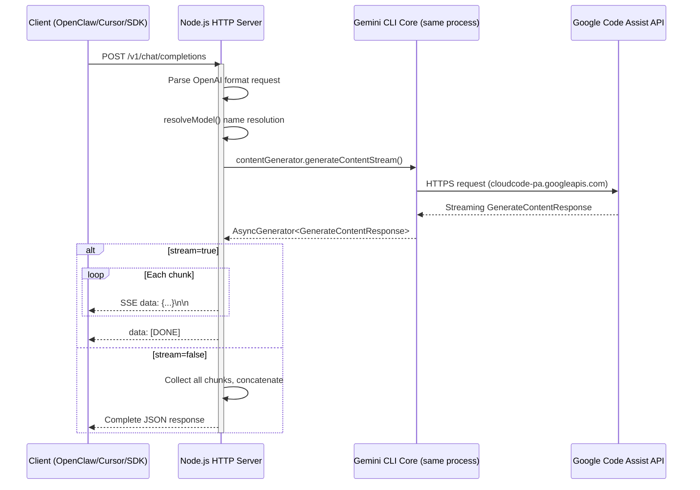

# GEMINI.md

> [!IMPORTANT]
> **AI Development Constraint**
> This project is deployed and runs on a **remote Linux server**, not the Windows system providing the IDE. AI assistants **must never use `run_command`** on Windows to start services, `curl`, or test endpoints. All debugging must rely on modifying TypeScript code and reviewing the `gemini-http.log` log file.

## Project Overview

`http-shell-for-gemini-cli` is a fork of Google [Gemini CLI](https://github.com/google-gemini/gemini-cli) with a new **`--http-server` mode** added directly inside the CLI. It exposes the CLI's authentication and model capabilities as an OpenAI Chat Completion compatible HTTP endpoint.

It directly reuses the CLI's internal `Config`, `ContentGenerator`, `resolveModel` and other modules to handle HTTP requests within the same process. First cold start takes ~10 seconds (OAuth authentication); subsequent requests have zero cold start latency.

## Core Architecture



## Core Files

| File | Purpose |
| :--- | :--- |
| `gemini-cli/packages/cli/src/httpServer.ts` | **★ HTTP Server core implementation** — routing, SSE streaming, tool call conversion, logging, signal handling |
| `gemini-cli/packages/cli/src/gemini.tsx` | CLI entry point — added `--http-server` branch that skips TUI and starts HTTP Server |
| `gemini-cli/packages/core/src/config/models.ts` | `resolveModel()` function — model alias → actual model name mapping |
| `gemini-http.log` | Runtime detailed log (`.gitignore`) |

## Code Structure — `httpServer.ts`

### Module Breakdown

| Area | Function | Responsibility |
| :--- | :--- | :--- |
| **Logging** | `consoleLog()` / `fileLog()` / `log()` | Dual-channel: stderr console summary + file detailed log. `consoleLog` uses `fs.writeSync(2, ...)` to bypass `patchStdio()` in gemini.tsx |
| **Type Definitions** | `OpenAIMessage` / `OpenAITool` / `OpenAIRequest` | TypeScript interfaces for OpenAI request format |
| **Format Conversion** | `extractTextContent()` | Handles OpenAI multimodal content (string or `{type, text}[]`) |
| **Tool Conversion** | `convertOpenAITools()` | OpenAI `tools` format → Gemini `FunctionDeclaration` format |
| **Message Conversion** | `convertToGeminiContents()` | OpenAI `messages[]` → Gemini `Content[]`, handles system/user/assistant/tool roles |
| **Response Building** | `buildStreamChunk()` / `buildNonStreamResponse()` | Build OpenAI-format streaming chunks and non-streaming full responses |
| **Core Handler** | `handleChatCompletion()` | Main request handler: parse request → resolve model → call `contentGenerator.generateContentStream()` → stream/non-stream response |
| **Route Entry** | `startHttpServer()` | HTTP server creation, route dispatch (`/v1/chat/completions` + alias `/chat/completions`), CORS, signal handling |

### Key Technical Details

#### 1. Model Name Resolution

```typescript
const rawModel = config.getModel();           // → "auto-gemini-3"
const model = resolveModel(rawModel);          // → "gemini-3-pro-preview"
```

`resolveModel()` is exported from `@google/gemini-cli-core` (`packages/core/src/config/models.ts`), mapping aliases to actual API model names. The httpServer uses `config.getModel()` to get the model, then resolves it via `resolveModel()`.

#### 2. Content Generation Call

```typescript
const contentGenerator = config.getContentGenerator();
const stream = await contentGenerator.generateContentStream(
    { model, contents: geminiContents, config: generateConfig },
    requestId,
    LlmRole.MAIN,
);
```

`contentGenerator` is an already-authenticated instance initialized during CLI startup — direct calls require no additional authentication.

#### 3. SSE Streaming Output

```typescript
res.writeHead(200, {
    'Content-Type': 'text/event-stream',
    'Cache-Control': 'no-cache',
    'Connection': 'keep-alive',
});
for await (const chunk of stream) {
    // Extract text / functionCall from GenerateContentResponse
    // Convert to OpenAI delta format
    res.write(`data: ${JSON.stringify(sseChunk)}\n\n`);
}
res.write('data: [DONE]\n\n');
```

#### 4. Function Calling (tool_calls) Support

Both streaming and non-streaming modes support native `tool_calls`:

- Extracted from `GenerateContentResponse`'s `part.functionCall`
- Converted to OpenAI format: `{ id, type: "function", function: { name, arguments } }`
- `finish_reason` set to `"tool_calls"`

#### 5. Signal Handling (Ctrl+C Exit)

Gemini CLI internally registers multiple SIGINT listeners (from Ink/React/auth subsystems) that prevent normal exit. Solution:

1. **Periodic cleanup**: Every 5 seconds, `removeAllListeners('SIGINT')` then re-register our own handler
2. **Stdin raw byte detection**: `process.stdin.setRawMode(true)` + listen for `0x03` (Ctrl+C byte) as fallback exit path
3. **Force exit**: Handler calls `process.exit(0)` directly without waiting for graceful shutdown

## CLI Entry Point Changes — `gemini.tsx`

In the CLI's `main()` function, the `--http-server` argument triggers this branch:

```typescript
if (args.httpServer) {
    const { startHttpServer } = await import('./httpServer.js');
    await startHttpServer(config, args.httpPort ?? 9000, args.httpHost ?? '0.0.0.0');
    return;  // Skip TUI/Ink rendering
}
```

yargs argument definitions added:
- `--http-server`: boolean, enable HTTP mode
- `--http-port`: number, listen port (default 9000)
- `--http-host`: string, bind address (default 0.0.0.0)

## Log Tags

| Tag | Content |
|-----|---------|
| `MAIN` | Server start/stop, signal capture |
| `MODEL` | Model name resolution (raw → resolved) |
| `REQUEST` | Request metadata: client IP, message count, tool list |
| `STREAM` | Streaming chunk details |
| `RESPONSE` | Non-streaming full response or streaming final summary |
| `ERROR` | Exception stacks and error details |

## Extension Guide

> [!TIP]
> Reference the following when modifying or extending features:

### Adding Sampling Parameters (temperature / max_tokens)

1. Add fields to the `OpenAIRequest` interface in `httpServer.ts`
2. Extract these parameters in `handleChatCompletion()`
3. Pass them into `generateContentStream()`'s `config` parameter (corresponds to `GenerateContentConfig` type)

### Supporting More Models

Model alias mapping is in `packages/core/src/config/models.ts`'s `resolveModel()` function. If a model name has no match in the switch-case, it's passed through as-is.

### Fixing API Errors

Common API error troubleshooting:

- **404 Not Found**: Check if `resolveModel()` returns a valid model name
- **400 Bad Request**: Check if `convertToGeminiContents()` message format conversion is correct
- **Auth errors**: Check if `config.getContentGenerator()` initialized successfully

### Process Won't Exit

If Ctrl+C doesn't work, check if `process.listenerCount('SIGINT')` shows new listeners being registered. The current solution uses stdin raw byte detection + periodic cleanup.
